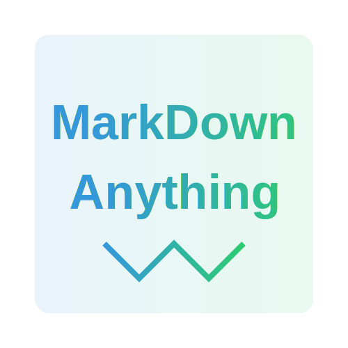
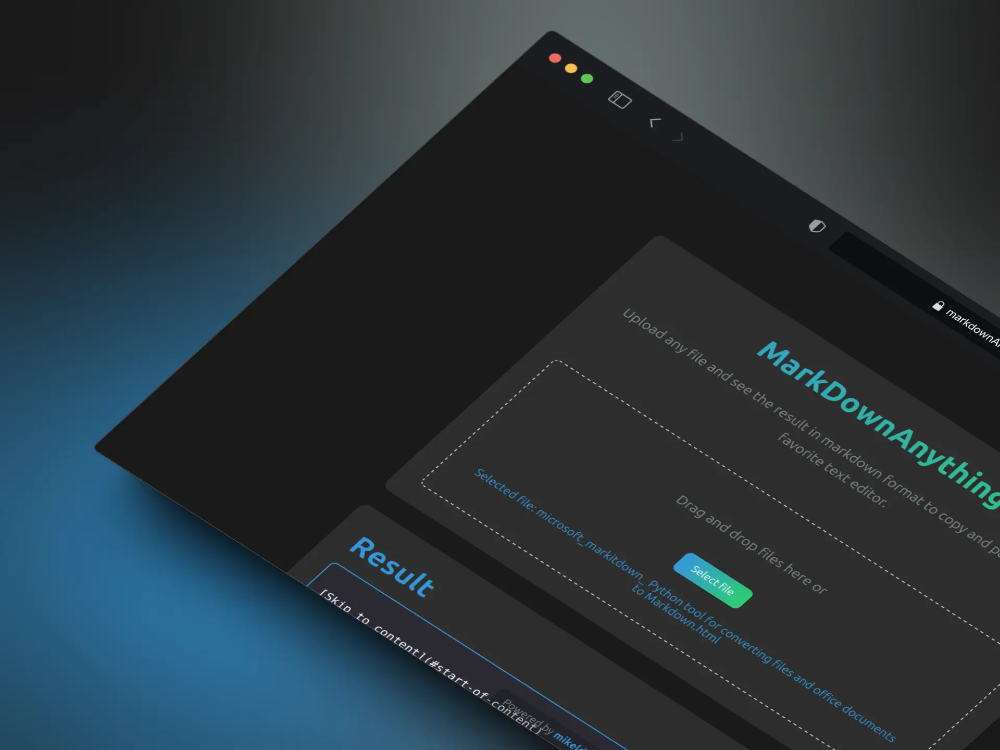

<div align="center">



🎯 Convierte cualquier archivo a formato Markdown de forma sencilla


</div>




## ✨ Características

- 📝 Conversión instantánea a Markdown
- 🎨 Interfaz moderna y responsive
- 🌓 Soporte para modo oscuro/claro
- 📋 Copiado al portapapeles con un clic
- 🚀 Instalación y configuración automática
- 💻 Multiplataforma (Windows, macOS, Linux)

## 🛠️ Requisitos Previos

- Node.js >= 14
- Python >= 3.8
- pip (gestor de paquetes de Python)

## ⚡ Instalación Rápida

1. Clona el repositorio:
```bash
git clone https://github.com/byronnDev/markdownanything.git
cd markdownanything
```

2. Instala las dependencias y configura el entorno:
```bash
npm run setup
```

Este comando:
- Crea un entorno virtual de Python
- Instala las dependencias de Python
- Instala las dependencias de Node.js
- Configura los directorios necesarios

## 🚦 Uso

1. Inicia la aplicación:
```bash
npm start
```

2. Abre tu navegador en `http://localhost:3002`
3. Sube cualquier archivo compatible
4. ¡Obtén tu markdown!
4. Una vez subido, asegúrate de actualizar estas URLs en el README.md:

## 📋 Formatos Soportados

- Documentos de texto (.txt, .doc, .docx)
- Hojas de cálculo (.xlsx, .csv)
- Presentaciones (.ppt, .pptx)
- PDF (.pdf)
- Y más...

## 🔧 Tecnologías

- Frontend:
  - HTML5
  - CSS3
  - JavaScript (ES6+)
- Backend:
  - Node.js
  - Express
  - Python
  - markitdown (librería Python)

## 🤝 Contribuir

1. Haz fork del proyecto
2. Crea tu rama de características (`git checkout -b feature/AmazingFeature`)
3. Haz commit de tus cambios (`git commit -m 'Add: alguna característica asombrosa'`)
4. Push a la rama (`git push origin feature/AmazingFeature`)
5. Abre un Pull Request

## ✨ Créditos

Desarrollado con ❤️ por Mikel Echeverria
